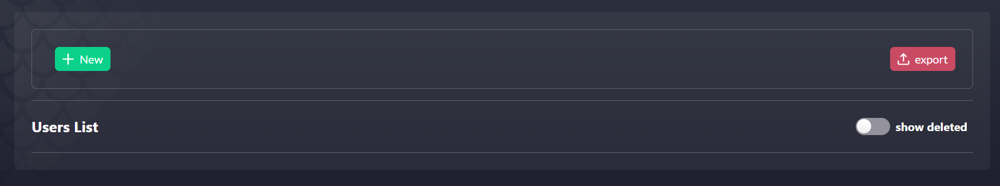
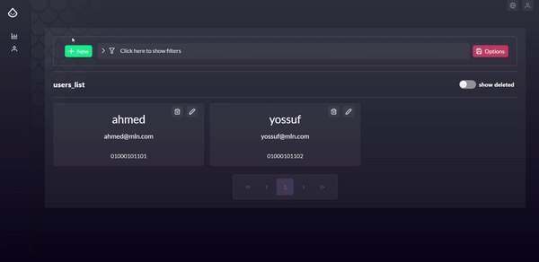

# primevue-dashboard-components

## introduction

Our primevue-dashboard-components package is a powerful tool designed to streamline and enhance your development process. It is built upon the robust PrimeVue library, leveraging its efficiency to cater to our specific use cases. 

The package introduces two primary components: `AppCard` and `AppCrud`, which are integral to all our project list features. These components simplify list feature development and offer extensive customization options through a variety of useful props, catering to a wide range of use cases.

The `AppCrud` component is the cornerstone of our package. It provides functionalities such as a 'Create' button that can either redirect to a new route or trigger a form pop-up on the same page, with control managed via props. It also accepts a filter form to refine the displayed data based on specific keys, and provides data export and import functionality. However, it does not encapsulate the entire list feature. Instead, it includes slots for data display, where the `AppCard` comes into play.

The `AppCard` component is designed to display specific data in a visually appealing format. It utilizes slots to place database information within these cards, already encapsulated with style for ready use. Each card can be updated or deleted directly, with event handling managed through prop functions.

## Usage

Now let's talk about how to use `AppCrud` component :

### AppCrud 

The role of 'props' in the `AppCrud` component is very important for its efficient utilization. To understand this, let's dive into how to effectively integrate this component into our 'ExampleDataList' view page. By mastering the art of passing props to the 'AppCrud' component, we can optimize its performance and functionality to suit our specific use case.

#### props

**options(required , object:CrudOptions)** :  This prop accepts an object of the "CrudOptions" type. It defines the Crud Options for the components . Here's the implementation of the "CrudOptions" type:

```
export type CrudOptions = {
    title: string,
    feature: string,
    importTemplateLink?: string,
    showExportButton: boolean,
    showCreateButton: boolean,
    showDeletedFilter: boolean
}
```

The "CrudOptions" type includes the following properties:

- `title`: Represents the title of the list feature we are working on. This will be displayed on the left header of the page.
- `feature`: A string that signifies the feature we are currently developing.
- `showExportButton`: A boolean that determines whether an 'Export' button should be displayed, based on if the feature has export functionality.
- `showCreateButton`: A boolean that decides if a 'Create' button should be present.
- `showDeletedFilter`: A boolean that decides if a 'Show Deleted' toggle button should be visible.
- `importTemplateLink?`: An optional string that provides the link for users to download a template. Users can modify this template with their specific data, import the file, and the imported data will be displayed instead of creating each row individually. if this property is not used , import functionality will not exists

Example : 

```
<script setup lang="ts">
import type { CrudOptions } from '@/types';

const options: CrudOptions = {
  title: "Users List",
  showCreateButton: true,
  feature: 'users',
  showExportButton: true,
  showDeletedFilter: true,
}

</script>
<template>
    <app-crud :options="options" class="roles"> 
    </app-crud>
</template>
```
Output : 


**createForm(optional , object:CreateForm)** : This optional prop accepts an object of the 'CreateForm' type. This prop determines whether the creation feature will appear as a pop-up form on the same page, or if it will be located on a separate route. If the 'createForm' prop is passed to the component, a form will pop up with the properties you've defined. If not, you will be redirected to the 'Create' page on a separate route. 

The 'CreateForm' type is implemented as follows:

```
export type CreateForm = {
    sections: FormKitSection[],
    options: FormKitOptions,
    submitHandler: FormSubmitHandler<any, any, any>,
    toastHandler?: FormKitToastHandler
}
```
You should have got familliar with `CreateForm` type properties as you have used them before while using formkit-builder package. For a comprehensive understanding of what values should be passed to the 'sections', 'options', 'submitHandler', and 'toastHandler' properties, please refer back to the ['formkit-builder documentation'](https://github.com/darwishdev/formkit-builder/blob/aa55dedafb4408f5a329e972e2b8dc7d02342f50/formkit-bulider.md). This resource provides detailed information on how to correctly utilize these properties.


Example : 

```
<script setup lang="ts">
import apiClient from '@/api/ApiMock';
import type {
  RoleDeleteRestoreRequest, UserCreateRequest, UserCreateResponse, UserUpdateRequest, UserUpdateResponse, UserFindRequest, UserFindResponse
} from '@/api/ApiTypes';
import type { CrudOptions , CreateForm} from '@/types';
import type { FormKitOptions, FormSubmitHandler, FormKitInput, FormKitComponent } from 'formkit-builder/types'
import { errorHandler, sections, toastHandler } from './UserForm'

const createOptions: FormKitOptions = {
  title: "user_create",
  allowBulkDelete: false,
}
const createFormSubmitHandler: FormSubmitHandler<UserCreateRequest, UserCreateRequest, UserCreateResponse> = {
  submit: apiClient.userCreate,
  errorHandler,
}
const createForm: CreateForm = {
  sections: sections,
  options: createOptions,
  submitHandler: createFormSubmitHandler,
  toastHandler: toastHandler,
}

const options: CrudOptions = {
  title: "Users List",
  showCreateButton: true,
  feature: 'users',
  showExportButton: true,
  showDeletedFilter: true,
}

</script>
<template>
    <app-crud :options="options" :createForm="createForm" class="users"> 
    </app-crud>
</template>
```


**filterForm(optional , object:FilterForm)** : This optional prop accepts an object of the 'FilterForm' type. This prop determines whether a filter form will be added, which can filter data based on specific keys. If the 'filterForm' prop is passed to the component, a well-designed filter form will be added to the component's header with the properties you've defined. If not passed, no filter form will be present

The 'FilterForm' type is implemented as follows:

```
export type FilterForm = {
    inputs: FormKitInput[] | FormKitComponent[],
    callBack?: () => any;
}
```

Example : 
```
<script setup lang="ts">
import apiClient from '@/api/ApiMock';
import type {
  RoleDeleteRestoreRequest, UserCreateRequest, UserCreateResponse, UserUpdateRequest, UserUpdateResponse, UserFindRequest, UserFindResponse
} from '@/api/ApiTypes';
import type { CrudOptions , CreateForm , FilterForm} from '@/types';
import type { FormKitOptions, FormSubmitHandler, FormKitInput, FormKitComponent } from 'formkit-builder/types'
import { errorHandler, sections, toastHandler } from './UserForm'

const createOptions: FormKitOptions = {
  title: "user_create",
  allowBulkDelete: false,
}
const createFormSubmitHandler: FormSubmitHandler<UserCreateRequest, UserCreateRequest, UserCreateResponse> = {
  submit: apiClient.userCreate,
  errorHandler,
}
const createForm: CreateForm = {
  sections: sections,
  options: createOptions,
  submitHandler: createFormSubmitHandler,
  toastHandler: toastHandler,
}

const inputs: Array<FormKitInput | FormKitComponent> = [
  {
    $formkit: 'text',
    outerClass: "col-3",
    name: 'userEmail',
    label: 'by_email_address',
    placeholder: 'Enter email address',
  },
  {
    $formkit: 'text',
    outerClass: "col-3",
    name: 'userName',
    label: 'by_username',
    placeholder: 'enter username',
  },

  {
    $formkit: 'text',
    outerClass: "col-3",
    name: 'UserPhone',
    label: 'phone_number',
    placeholder: 'Type phone number',
  },
]

const filterForm: FilterForm = {
  inputs,
}

const options: CrudOptions = {
  title: "Users List",
  showCreateButton: true,
  feature: 'users',
  showExportButton: true,
  showDeletedFilter: true,
}

</script>
<template>
    <app-crud :options="options" :filterForm="filterForm" :createForm="createForm" class="users"> 
    </app-crud>
</template>
```
Output : 


**importHandler(optional , object:ImportHandler)** : This optional prop takes an object of the 'ImportHandler' type. It manages the import functionality by invoking the 'bulkCreate' function, which is tasked with creating and saving the imported data in the database, thus eliminating the need for the user to save each row individually. If you're utilizing the import feature, it's essential to pass this prop.

The 'ImportHandler' type is implemented as follows:

```
export interface ImportHandler<Req, Resp> {
    bulkCreate: (req: Req) => Promise<Resp>
    callBack?: (resp: Resp) => any;
    errorHandler?: Record<string, string>
    toastHandler?: FormKitToastHandler
}
```
- As outlined, `bulkCreate` : is the required function for saving the imported data 
- `callBack` : is an optional function that allows to perform some changes or logic using the response returned from the bulkCreate function.
- `errorHandler` : is an optional property which is responsible for mapping error keys to error messages
- `toastHandler` : is an optional property of type 'FormKitToastHandler' which handle toast notifications appearance.For a comprehensive understanding of what values should be passed to the 'FormKitToastHandler' properties, please refer back to the 'formkit-builder' documentation.

Example : 
```
<script setup lang="ts">
import apiClient from '@/api/ApiMock';
import type {
  RoleDeleteRestoreRequest, UserCreateRequest, UserCreateResponse, UserUpdateRequest, UserUpdateResponse, UserFindRequest, UserFindResponse
} from '@/api/ApiTypes';
import type { CrudOptions , CreateForm , FilterForm , ImportHandler} from '@/types';
import type { FormKitOptions, FormSubmitHandler, FormKitInput, FormKitComponent } from 'formkit-builder/types'
import { errorHandler, sections, toastHandler } from './UserForm'

const createOptions: FormKitOptions = {
  title: "user_create",
  allowBulkDelete: false,
}
const createFormSubmitHandler: FormSubmitHandler<UserCreateRequest, UserCreateRequest, UserCreateResponse> = {
  submit: apiClient.userCreate,
  errorHandler,
}
const createForm: CreateForm = {
  sections: sections,
  options: createOptions,
  submitHandler: createFormSubmitHandler,
  toastHandler: toastHandler,
}

const inputs: Array<FormKitInput | FormKitComponent> = [
  {
    $formkit: 'text',
    outerClass: "col-3",
    name: 'userEmail',
    label: 'by_email_address',
    placeholder: 'Enter email address',
  },
  {
    $formkit: 'text',
    outerClass: "col-3",
    name: 'userName',
    label: 'by_username',
    placeholder: 'enter username',
  },

  {
    $formkit: 'text',
    outerClass: "col-3",
    name: 'UserPhone',
    label: 'phone_number',
    placeholder: 'Type phone number',
  },
]

const filterForm: FilterForm = {
  inputs,
}

const options: CrudOptions = {
  title: "Users List",
  showCreateButton: true,
  feature: 'users',
  showExportButton: true,
  showDeletedFilter: true,
}

const importHandler: ImportHandler<UserBulkCreateRequest, UserBulkCreateResponse> = {
  bulkCreate: apiClient.roleBulkCreate,
}

</script>
<template>
    <app-crud :options="options" :ImportHandler="ImportHandler" :filterForm="filterForm" :createForm="createForm" class="users"> 
    </app-crud>
</template>
```

#### Emited functions (events) 

We need to pay attention to some specific events, or functions, and use them correctly. This can be really helpful.

**@imported**
The `@imported` event is the first one to note. Its primary function is to signal that user data has been imported. Upon receiving this event, you can initiate specific actions in response. For instance, you might choose to fetch or refresh data, ensuring that the most recent user-imported data is included in your operations.

for example : 

```
<script setup lang="ts">
import apiClient from '@/api/ApiMock';
import type {
  RoleDeleteRestoreRequest, UserCreateRequest, UserCreateResponse, UserUpdateRequest, UserUpdateResponse, UserFindRequest, UserFindResponse
} from '@/api/ApiTypes';
import type { CrudOptions , CreateForm , FilterForm , ImportHandler} from '@/types';
import type { FormKitOptions, FormSubmitHandler, FormKitInput, FormKitComponent } from 'formkit-builder/types'
import { errorHandler, sections, toastHandler } from './UserForm'

const createOptions: FormKitOptions = {
  title: "user_create",
  allowBulkDelete: false,
}
const createFormSubmitHandler: FormSubmitHandler<UserCreateRequest, UserCreateRequest, UserCreateResponse> = {
  submit: apiClient.userCreate,
  errorHandler,
}
const createForm: CreateForm = {
  sections: sections,
  options: createOptions,
  submitHandler: createFormSubmitHandler,
  toastHandler: toastHandler,
}

const options: CrudOptions = {
  title: "Users List",
  showCreateButton: true,
  feature: 'users',
  showExportButton: true,
  showDeletedFilter: true,
}

const importHandler: ImportHandler<UserBulkCreateRequest, UserBulkCreateResponse> = {
  bulkCreate: apiClient.roleBulkCreate,
}

const imported = (data: any) => {
  console.log('importd')
  fetchData()
}
</script>
<template>
    <app-crud :options="options" @imported="imported" :ImportHandler="ImportHandler" :createForm="createForm" class="users"> 
    </app-crud>
</template>
```

**@export**
The `@export` event is the second one to note. Its used to alert you that the user have clicked on the export buttopn. Upon receiving this event, you can call the function that will export the specific data that you will choose
for example : 

```
<script setup lang="ts">
import apiClient from '@/api/ApiMock';
import type {
  RoleDeleteRestoreRequest, UserCreateRequest, UserCreateResponse, UserUpdateRequest, UserUpdateResponse, UserFindRequest, UserFindResponse
} from '@/api/ApiTypes';
import type { CrudOptions , CreateForm , FilterForm , ImportHandler} from '@/types';
import type { FormKitOptions, FormSubmitHandler, FormKitInput, FormKitComponent } from 'formkit-builder/types'
import { errorHandler, sections, toastHandler } from './UserForm'

const createOptions: FormKitOptions = {
  title: "user_create",
  allowBulkDelete: false,
}
const createFormSubmitHandler: FormSubmitHandler<UserCreateRequest, UserCreateRequest, UserCreateResponse> = {
  submit: apiClient.userCreate,
  errorHandler,
}
const createForm: CreateForm = {
  sections: sections,
  options: createOptions,
  submitHandler: createFormSubmitHandler,
  toastHandler: toastHandler,
}

const options: CrudOptions = {
  title: "Users List",
  showCreateButton: true,
  feature: 'users',
  showExportButton: true,
  showDeletedFilter: true,
}

const importHandler: ImportHandler<UserBulkCreateRequest, UserBulkCreateResponse> = {
  bulkCreate: apiClient.roleBulkCreate,
}

const imported = (data: any) => {
  console.log('importd')
  fetchData()
}

const exportCSV = () => {
  const data = showDeletedData.value ? responseData.value?.deleteUsers as unknown[] : responseData.value?.users as unknown[]
  exportCSV(data)
}

</script>
<template>
    <app-crud :options="options" @imported="imported" @export="exportCSV" :ImportHandler="ImportHandler" :createForm="createForm" class="users"> 
    </app-crud>
</template>
```

**@filtered**

Another noteworthy event is `@filtered`. This event is designed to send a filterObject, which includes a key symbolizing the name of the filter utilized by the user, as well as a value representing the filter value that the user has applied to sort the data. It's important to note that this event is only activated when we pass the filterForm prop, which is responsible for generating the filter form. This allows for a dynamic and user-responsive filtering process, enhancing the overall data management experience.

for example : 

```
<script setup lang="ts">
import apiClient from '@/api/ApiMock';
import type {
  RoleDeleteRestoreRequest, UserCreateRequest, UserCreateResponse, UserUpdateRequest, UserUpdateResponse, UserFindRequest, UserFindResponse
} from '@/api/ApiTypes';
import type { CrudOptions , CreateForm , FilterForm , ImportHandler} from '@/types';
import type { FormKitOptions, FormSubmitHandler, FormKitInput, FormKitComponent } from 'formkit-builder/types'
import { errorHandler, sections, toastHandler } from './UserForm'

const { responseData, loading, error, fetchData } = useDataFetcherList<UsersListRequest, UsersListResponse>(apiClient.usersList, {} as UsersListRequest);

const createOptions: FormKitOptions = {
  title: "user_create",
  allowBulkDelete: false,
}
const createFormSubmitHandler: FormSubmitHandler<UserCreateRequest, UserCreateRequest, UserCreateResponse> = {
  submit: apiClient.userCreate,
  errorHandler,
}
const createForm: CreateForm = {
  sections: sections,
  options: createOptions,
  submitHandler: createFormSubmitHandler,
  toastHandler: toastHandler,
}

const options: CrudOptions = {
  title: "Users List",
  showCreateButton: true,
  feature: 'users',
  showExportButton: true,
  showDeletedFilter: true,
}

const importHandler: ImportHandler<UserBulkCreateRequest, UserBulkCreateResponse> = {
  bulkCreate: apiClient.roleBulkCreate,
}

const imported = (data: any) => {
  console.log('importd')
  fetchData()
}

const exportCSV = () => {
  const data = showDeletedData.value ? responseData.value?.deleteUsers as unknown[] : responseData.value?.users as unknown[]
  exportCSV(data)
}
const inputs: Array<FormKitInput | FormKitComponent> = [
  {
    $formkit: 'text',
    outerClass: "col-3",
    name: 'userEmail',
    label: 'by_email_address',
    placeholder: 'Enter email address',
  },
  {
    $formkit: 'text',
    outerClass: "col-3",
    name: 'userName',
    label: 'by_username',
    placeholder: 'enter username',
  },

  {
    $formkit: 'text',
    outerClass: "col-3",
    name: 'UserPhone',
    label: 'phone_number',
    placeholder: 'Type phone number',
  },
]

const filterForm: FilterForm = {
  inputs,
}
const filtered = (filterObject: any) => {
  console.log(filterObject);
  let key = filterObject.key
  let value = filterObject.value
  let filtered = responseData.value?.users.filter((user : any) => user[key] == value);
  responseData.value.users = filtered
  console.log(responseData.value);
}

</script>
<template>
    <app-crud :options="options" :filterForm="filterForm" @filtered="filtered" @imported="imported" @export="exportCSV" :ImportHandler="ImportHandler" :createForm="createForm" class="users"> 
    </app-crud>
</template>
```


**@filtersCleared**

Yet another event to be mindful of is `@filtersCleared`. This event serves to notify you when a user has removed all previously applied filters. By listening for this event, you can take action to revert back and display the original, unfiltered data. This ensures that the data presented is always in line with the user's current filtering preferences, providing a seamless and user-friendly experience.

### Slots

The AppCrud component is a highly customizable tool that leverages the power of Vue.js 3 slots. Slots are a feature that allows you to compose components in a flexible way. They let you inject any type of content into a component, acting like placeholders that can be filled with your own custom HTML content. This makes your components more reusable and clean, as you can control the layout and structure of the injected content from the parent component.

#### header-left-buttons
This slot allows for the addition of extra buttons next to the create button on the component's left header. This provides additional functionality right at your fingertips.

#### filters
This slot enables the addition of a custom filter form. It eliminates the need for using filterForm props, giving us the freedom to handle its logic within the parent component.

#### header-right-buttons
This slot is used for adding buttons to the right header of the component, providing more options for user interaction.

#### header-title
This slot can be utilized to override the default title generated from the options prop, allowing for a more personalized header title.

#### data
This is the most crucial slot. It's used to display the data that we wish to list on the page, providing a flexible and customizable way to present information.

We'll see a full example for the `AppCrud` component using the slots after the `AppCard` component

### AppCard 

Now let's talk about how to use `AppCard` component :

As we said before, the `AppCard` component is designed to display specific data in a visually appealing format. It utilizes slots to place database information within these cards, already encapsulated with style for ready use. Each card can be updated or deleted directly, with event handling managed through prop functions.

#### props

**recordId(required , number)** : `recordId` is a required prop that represents the `id` property of the data record that we are displaying in this card. This prop will be used in the deletion and edit functionalities so it's required to be passed to the component

**updateForm(optional , UpdateForm)** : this is an optional prop that accepts an object of the `UpdateForm` type , this prop determines if the update form will pop up in the same page or it will be in a separated route. If the prop is passed to the component, an update form with the properties that we have specified will be generated and it will pop up in the same page , if it is not passed the component will redirect us to the update route when the edit icon is clicked 

the `UpdateForm` type is implemented as follows : 

```
export type UpdateForm = {
    sections: FormKitSection[]
    options: FormKitOptions
    findHandler: FormFindDataHandler
    submitHandler: FormSubmitHandler<any, any, any>
    toastHandler?: FormKitToastHandler
}
```
You should have got familliar with `UpdateForm` type properties as you have used them before while using formkit-builder package. For a comprehensive understanding of what values should be passed to the 'sections', 'options', 'submitHandler', 'findHandler', and 'toastHandler' properties, please refer back to the ['formkit-builder documentation'](https://github.com/darwishdev/formkit-builder/blob/aa55dedafb4408f5a329e972e2b8dc7d02342f50/formkit-bulider.md). This resource provides detailed information on how to correctly utilize these properties.


**deleteRestoreHandler(optional , DeleteRestoreHandler)** :  is an optional prop that accepts an object of the `DeleteRestoreHandler` type. This prop is utilized to pass the `DeleteRestore` function, which is invoked upon clicking the delete button. 

The `DeleteRestoreHandler` type is implemented as follows:

```
export interface DeleteRestoreHandler<Req> {
    deleteRestore: (req: Req) => void
    callBack?: () => any;
    indentifierPropertyName?: string;
    errorHandler?: Record<string, string>
    toastHandler?: FormKitToastHandler
}
```

Here's a breakdown of its properties:

- `deleteRestore`: This is a mandatory function responsible for executing the delete or restore action.
- `indentifierPropertyName?`: This optional string identifies the property name that the deletion function will be based on.
- `errorHandler`: An optional property that maps error keys to their corresponding error messages.
- `toastHandler`: An optional property of the `FormKitToastHandler` type. This handles the display of toast notifications.

### Slots

The `AppCard` component makes use of Vue.js slots to provide a flexible layout for displaying record data within the card. This component utilizes two primary slots, namely "start" and "end".


#### Start Slot

The "start" slot is designed to display data at the beginning of the card. It provides the flexibility to customize the initial section of the card with your specific data.

#### End Slot

The "end" slot, on the other hand, is used to display data at the end of the card. This allows for tailoring the final section of the card to suit your particular needs.

By employing these two slots, the `AppCard` component offers a customizable and adaptable layout for presenting your record data.

example on using `AppCard` component inside `AppCrud` : 

```
<script setup lang="ts">
import apiClient from '@/api/ApiMock';
import type { UsersListRequest, UsersListResponse } from '@/api/ApiTypes'
import { useDataFetcherList } from 'vue-data-fetcher'
import type {
  RoleDeleteRestoreRequest, UserCreateRequest, UserCreateResponse, UserUpdateRequest, UserUpdateResponse, UserFindRequest, UserFindResponse
} from '@/api/ApiTypes';
import type { CrudOptions , CreateForm , FilterForm , ImportHandler} from '@/types';
import type { FormKitOptions, FormSubmitHandler, FormKitInput, FormKitComponent,FormFindDataHandler } from 'formkit-builder/types'
import { errorHandler, sections, toastHandler } from './UserForm'

const { responseData, loading, error, fetchData } = useDataFetcherList<UsersListRequest, UsersListResponse>(apiClient.usersList, {} as UsersListRequest);

const createOptions: FormKitOptions = {
  title: "user_create",
  allowBulkDelete: false,
}
const createFormSubmitHandler: FormSubmitHandler<UserCreateRequest, UserCreateRequest, UserCreateResponse> = {
  submit: apiClient.userCreate,
  errorHandler,
}
const createForm: CreateForm = {
  sections: sections,
  options: createOptions,
  submitHandler: createFormSubmitHandler,
  toastHandler: toastHandler,
}

const options: CrudOptions = {
  title: "Users List",
  showCreateButton: true,
  feature: 'users',
  showExportButton: true,
  showDeletedFilter: true,
}

const importHandler: ImportHandler<UserBulkCreateRequest, UserBulkCreateResponse> = {
  bulkCreate: apiClient.roleBulkCreate,
}

const imported = (data: any) => {
  console.log('importd')
  fetchData()
}

const exportCSV = () => {
  const data = showDeletedData.value ? responseData.value?.deleteUsers as unknown[] : responseData.value?.users as unknown[]
  exportCSV(data)
}
const inputs: Array<FormKitInput | FormKitComponent> = [
  {
    $formkit: 'text',
    outerClass: "col-3",
    name: 'userEmail',
    label: 'by_email_address',
    placeholder: 'Enter email address',
  },
  {
    $formkit: 'text',
    outerClass: "col-3",
    name: 'userName',
    label: 'by_username',
    placeholder: 'enter username',
  },

  {
    $formkit: 'text',
    outerClass: "col-3",
    name: 'UserPhone',
    label: 'phone_number',
    placeholder: 'Type phone number',
  },
]

const filterForm: FilterForm = {
  inputs,
}
const filtered = (filterObject: any) => {
  console.log(filterObject);
  let key = filterObject.key
  let value = filterObject.value
  let filtered = responseData.value?.users.filter((user : any) => user[key] == value);
  responseData.value.users = filtered
  console.log(responseData.value);
}

const updateFormSubmitHandler: FormSubmitHandler<UserUpdateRequest, UserUpdateRequest, UserUpdateResponse> = {
  submit: apiClient.userUpdate,
  errorHandler,
}
const updateFormFindHandler: FormFindDataHandler<UserFindRequest, UserFindResponse, any> = {
  findData: apiClient.userFind,
  findRequerPropertyName: 'userId',
}
const updateForm: UpdateForm = {
  sections: sections,
  options: createOptions,
  submitHandler: updateFormSubmitHandler,
  findHandler: updateFormFindHandler,
  toastHandler: toastHandler,
}
</script>
<template>
    <app-crud :options="options" :filterForm="filterForm" @filtered="filtered" @imported="imported" @export="exportCSV" :ImportHandler="ImportHandler" :createForm="createForm" class="roles"> 
        <template #data>
            <app-card :class="{ 'app-card-restore': showDeletedData }"
              :updateForm="updateForm" :recordId="1" >
              <template #start>
              </template>
              <template #end>
                  <div class="flex flex-column text-center py-3">
                    <h1 class="my-1">{{ responseData!.users[0].userName }}</h1>
                    <h3 class="my-1">{{ responseData!.users[0].userEmail }}</h3>
                    <h4 class="mt-4">{{ responseData!.users[0].userPhone }}</h4>
                </div>
              </template>
            </app-card>  
        </template>
    </app-crud>
</template>
```
output : 


full example using `AppCard` and `AppCrud` components : 

```
<script setup lang="ts">
import apiClient from '@/api/ApiMock';
import type { UsersListRequest, UsersListResponse } from '@/api/ApiTypes'
import DataView from 'primevue/dataview';
import { useDataFetcherList } from 'vue-data-fetcher'
import { ref,onMounted } from 'vue'
import type { FormFindDataHandler, FormKitOptions, FormSubmitHandler, FormKitInput, FormKitComponent } from 'formkit-builder/types'
import type {
  RoleDeleteRestoreRequest, UserCreateRequest, UserCreateResponse, UserUpdateRequest, UserUpdateResponse, UserFindRequest, UserFindResponse
} from '@/api/ApiTypes';
import LogoError from '@/assets/logo-error.svg'
import type { CreateForm, UpdateForm, CrudOptions, FilterForm, ImportHandler } from '@/types';
import { exportCSV } from "@/utils/helpers"
import { errorHandler, sections, toastHandler } from './UserForm'
import type { DeleteRestoreHandler } from '@/types'
const dataview = ref()

const createOptions: FormKitOptions = {
  title: "user_create",
  allowBulkDelete: false,
}
const createFormSubmitHandler: FormSubmitHandler<UserCreateRequest, UserCreateRequest, UserCreateResponse> = {
  submit: apiClient.userCreate,
  errorHandler,
}
const updateFormSubmitHandler: FormSubmitHandler<UserUpdateRequest, UserUpdateRequest, UserUpdateResponse> = {
  submit: apiClient.userUpdate,
  errorHandler,
}

const deleteRestoreHandler: DeleteRestoreHandler<RoleDeleteRestoreRequest> = {
   deleteRestore: apiClient.roleDeleteRestore,
   indentifierPropertyName: 'roleId',
 }

const updateFormFindHandler: FormFindDataHandler<UserFindRequest, UserFindResponse, any> = {
  findData: apiClient.userFind,
  findRequerPropertyName: 'userId',
}
const createForm: CreateForm = {
  sections: sections,
  options: createOptions,
  submitHandler: createFormSubmitHandler,
  toastHandler: toastHandler,
}
const updateForm: UpdateForm = {
  sections: sections,
  options: createOptions,
  submitHandler: updateFormSubmitHandler,
  findHandler: updateFormFindHandler,
  toastHandler: toastHandler,
}
const options: CrudOptions = {
  title: "users_list",
  showCreateButton: true,
  feature: 'users',
  showExportButton: true,
  importTemplateLink: "https://static.exploremelon.com/mln_rms/import-templates/Roles.xlsx",
  showDeletedFilter: true,
}
const showDeletedData = ref(false)
const { responseData, loading, error, fetchData } = useDataFetcherList<UsersListRequest, UsersListResponse>(apiClient.usersList, {} as UsersListRequest);
let tempResponseData : UsersListResponse | null  = { users: [] , deleteUsers : []}

onMounted(() => {
  setTimeout(() => {
    tempResponseData = responseData.value
  }, 1000);
})

// function onDialogSubmitted(recordId: number) {
//   const request: any = {
//     roleId: recordId,

//   }
// }

const showDeletedHandler = (val: any) => {
  showDeletedData.value = val
}
const imported = (data: any) => {
  console.log('importd')
}
const exportCSVv = () => {
  const data = showDeletedData.value ? responseData.value?.deleteUsers as unknown[] : responseData.value?.users as unknown[]
  exportCSV(data)
}


const inputs: Array<FormKitInput | FormKitComponent> = [
  {
    $formkit: 'text',
    outerClass: "col-3",
    name: 'userEmail',
    label: 'by_email_address',
    placeholder: 'Enter email address',
  },
  {
    $formkit: 'text',
    outerClass: "col-3",
    name: 'userName',
    label: 'by_username',
    placeholder: 'enter username',
  },

  {
    $formkit: 'text',
    outerClass: "col-3",
    name: 'UserPhone',
    label: 'phone_number',
    placeholder: 'Type phone number',
  },
]

const filtered = (filterObject: any) => {
  console.log(filterObject);
  let key = filterObject.key
  let value = filterObject.value
  let filtered = responseData.value?.users.filter((user : any) => user[key] == value);
  responseData.value.users = filtered
  console.log(responseData.value);
}

const filtersCleared = () => {
  apiClient.usersList().then((result) => {
      responseData.value = result
  })
}

const filterForm: FilterForm = {
  inputs,
}

// const importHandler: ImportHandler<RoleBulkCreateRequest, RoleBulkCreateResponse> = {
//   bulkCreate: apiClient.roleBulkCreate,
// }
</script>

<template>
  <app-crud @imported="imported" @export="exportCSVv" :filterForm="filterForm"
    :createForm="createForm" :options="options" @filtered="filtered" @showDeleted="showDeletedHandler" @filtersCleared="filtersCleared" class="roles">
    <template #data>
      <div class="grid" v-if="loading">
        <app-card-loading class="col " v-for="i in 3" :key="i" />
      </div>
      <div v-else-if="error">
        <div class="error text-center">
          <logo-error class=" mt-4" />
          <h2 class="text-3xl"> {{ $t("list_error") }}</h2>
          <i class="pi pi-refresh text-3xl mt-4 cursor-pointer" @click="fetchData"></i>
        </div>
      </div>
      <data-view v-else-if="responseData" ref="dataview"
        :value="showDeletedData ? responseData!.deleteUsers : responseData!.users" paginator layout="grid"
        dataKey="role_id" :rows="9">
        <template #grid="slotProps">
          <div class="col-12 sm:col-6 lg:col-12 xl:col-4 p-2">
            <app-card :class="{ 'app-card-restore': showDeletedData }"
              :updateForm="updateForm" :recordId="slotProps.data.roleId" >
              <template #start>
              </template>
              <template #end>
                  <div class="flex flex-column text-center py-3">
                    <h1 class="my-1">{{ slotProps.data.userName }}</h1>
                    <h3 class="my-1">{{ slotProps.data.userEmail }}</h3>
                    <h4 class="mt-4">{{ slotProps.data.userPhone }}</h4>
                </div>
              </template>
            </app-card>
          </div>
        </template>
      </data-view>
    </template>
  </app-crud>
</template>
```

Output :



